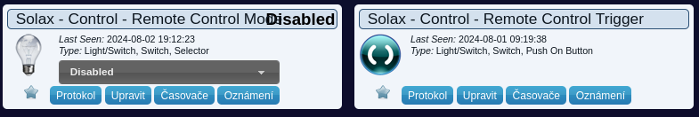

# Domoticz-Solax-plugin
It is primary developed to be able to monitor Solax inverter from Domoticz software via Mod-bus over TCP/IP. Base on the requests from users I decided to implement also control functionality to the plugin. Finally current version support monitoring and remote control as well. The implementation works with registers which are dealing with real-time operation only. Basically it means that there are no configuration functions which are writing data into EEPROM of the device as a part of permanent configuration. Finally it means that there is no issue with limited number od write cycles to EEPROM. In the other hand if device is restarted remote control configuration will disappear.
All the standard operational information which are collected by default version are visible on pictures below.

### Utility tab


### Temperature tab


### Switches tab


Remote control functions are controlled by Domoticz devices on Utility tab which shown on picture.


Mode selection of the remote control a trigger button can be find on Switches tab. See picture below.



The whole process can be monitored via number od Domoticz devices shown on picture below.


## Prerequisites
* Running Domoticz software
* The installation of additional python3 library – pymodbus is necessary.
```
sudo pip3 install -U pymodbus
```
The current version of the plugin was tested with Domoticz version 2024.4, python 3.11.2, libpython 3.11 and pymodbus 3.6.8

## Installation
* Place the folder inside Domoticz plugin folder e.g. :
```
/home/domoticz/plugin/Solax
```
* Copy plugin.py from repository folder to the folder created in previous step.
* Restart Domoticz.
```
sudo service domoticz.sh restart
```
or
```
docker restart domoticz
```
The exact command depends on your installation.

## Configuration

